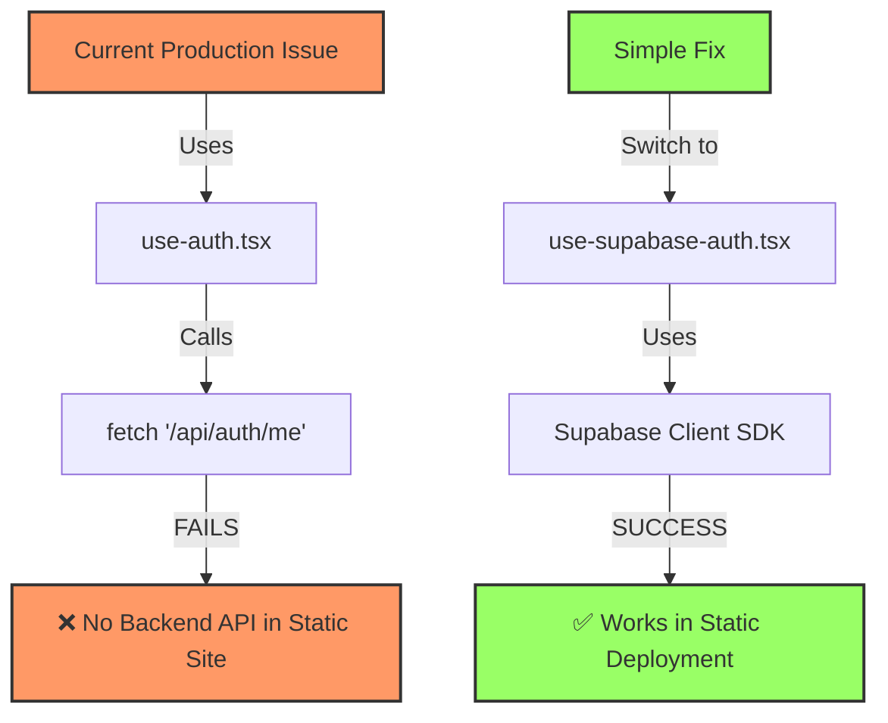

# 🔧 FitForge Production Deployment Fix Plan

**Issue**: React Context Error - "useAuth must be used within AuthProvider"  
**Root Cause**: useAuth hook being called outside of AuthProvider context  
**Status**: 🔴 Production broken, but fixable with systematic approach  
**Estimated Fix Time**: 30-60 minutes

---

## 🎯 Executive Summary

The FitForge deployment succeeded technically (app builds and deploys), but the application crashes at runtime due to using the wrong authentication system. The app is trying to use a backend-dependent auth system (`use-auth.tsx`) in a static site deployment where no backend exists. The fix is simple: switch to the Supabase auth system (`use-supabase-auth.tsx`) that's already implemented and designed for static deployments.

### Visual Explanation



---

## 🔍 Problem Analysis

### What Works ✅
1. **Digital Ocean Deployment Pipeline**: Successfully builds and deploys
2. **Supabase Configuration**: Environment variables properly configured
3. **Build Process**: TypeScript compiles without errors
4. **Static Hosting**: Digital Ocean serves the app correctly
5. **Minimal Test App**: Simple version without auth works perfectly

### What's Broken ❌
1. **Context Initialization Order**: useAuth called outside AuthProvider
2. **Component Structure**: Router component using auth context before it's provided
3. **Runtime Error**: App crashes immediately on load in production

### Root Cause
```typescript
// Current problematic structure in App.tsx:
function Router() {
  const { user, isLoading } = useAuth(); // ❌ ERROR: Called before AuthProvider wraps it
  // ...
}

function App() {
  return (
    <AuthProvider>
      <Router /> {/* Router tries to use auth context that doesn't exist yet */}
    </AuthProvider>
  );
}
```

---

## 🛠️ Systematic Fix Approach

### Phase 1: Immediate Fix (15 minutes)
**Goal**: Get production working with minimal changes

#### Option A: Switch to Supabase Auth (RECOMMENDED - ROOT CAUSE FIX)
```typescript
// In App.tsx, change the import:
- import { AuthProvider, useAuth } from "@/hooks/use-auth";
+ import { AuthProvider, useAuth } from "@/hooks/use-supabase-auth";

// That's it! The Supabase auth provider:
// ✅ Works with static deployment (no backend API needed)
// ✅ Uses Supabase for authentication
// ✅ Has proper loading states
// ✅ Handles context correctly
```

#### Option B: Split Router Component (IF OPTION A FAILS)
```typescript
// Create an inner component that can safely use auth context
function AppRouter() {
  const { user, isLoading } = useAuth(); // ✅ Now inside AuthProvider
  const [location] = useLocation();
  
  // Initialize data migration
  useDataMigration({
    autoMigrate: true,
    onMigrationComplete: (result) => {
      console.log(`✅ Data migration completed: v${result.fromVersion} → v${result.toVersion}`);
    },
    onMigrationError: (error) => {
      console.error('❌ Data migration failed:', error);
    }
  });

  if (isLoading) {
    return (
      <div className="min-h-screen bg-background flex items-center justify-center">
        <div className="text-center">
          <div className="animate-spin rounded-full h-8 w-8 border-b-2 border-primary mx-auto mb-4"></div>
          <p className="text-muted-foreground">Loading FitForge...</p>
        </div>
      </div>
    );
  }

  return (
    <div className="min-h-screen bg-background">
      <Navigation />
      <Switch>
        {/* Routes remain the same */}
      </Switch>
      <MigrationStatus />
    </div>
  );
}

// Outer Router just handles providers
function Router() {
  return <AppRouter />;
}
```

#### Option B: Remove Auth from Initial Load
```typescript
// Modify useAuth hook to handle static deployment
export function AuthProvider({ children }: { children: React.ReactNode }) {
  const [user, setUser] = useState<User | null>(null);
  const [token, setToken] = useState<string | null>(null);
  const [isLoading, setIsLoading] = useState(false); // ✅ Start as false for static site
  
  useEffect(() => {
    // Skip API call in production static deployment
    if (process.env.NODE_ENV === 'production') {
      // Check localStorage for existing session
      const savedToken = localStorage.getItem("fitforge-token");
      if (savedToken) {
        // Validate token with Supabase instead
        validateSupabaseSession();
      }
      return;
    }
    
    // Development auto-login
    fetchCurrentUser();
  }, []);
  
  // ... rest of implementation
}
```

### Critical Discovery: Wrong Auth Provider! 🚨
**Problem**: App is using `use-auth.tsx` which expects a backend API (`/api/auth/me`)  
**Reality**: FitForge is deployed as a static site - there is no backend API!  
**Solution**: The app already has `use-supabase-auth.tsx` - we need to use it!

This is the REAL root cause. The app is trying to use an auth system designed for a full-stack deployment when it should be using Supabase auth for the static deployment.

### Phase 2: Test Locally (10 minutes)
1. **Apply chosen fix to App.tsx**
2. **Run local build**: `npm run build`
3. **Test production build**: `npm run preview`
4. **Verify no console errors**
5. **Test auth flow**: Register → Login → Dashboard

### Phase 3: Deploy Fix (5 minutes)
```bash
# Commit the fix
git add client/src/App.tsx
git commit -m "fix: Resolve useAuth context initialization error in production

- Move useAuth hook inside AuthProvider boundary
- Prevent context access before provider initialization
- Fix production runtime crash while maintaining auth functionality"

# Push to trigger deployment
git push origin master
```

### Phase 4: Verify Production (10 minutes)
1. **Monitor deployment**: Watch Digital Ocean build logs
2. **Test production URL**: https://fitforge-free-9zezd.ondigitalocean.app
3. **Check console**: No errors should appear
4. **Test user flows**: Registration, login, navigation
5. **Verify data persistence**: Create workout, refresh, verify data

---

## 📋 Success Criteria

### Immediate Success ✅
- [ ] No console errors on production load
- [ ] Home page renders correctly
- [ ] Navigation works without crashes
- [ ] Build and deployment succeed

### Full Success ✅
- [ ] User registration works
- [ ] Login/logout functionality operational
- [ ] Protected routes properly secured
- [ ] Workout creation and logging functional
- [ ] Data persists across sessions

---

## 🔄 Fallback Strategies

### If Primary Fix Fails:

#### Fallback 1: Simplified Auth Provider
Create a minimal auth provider that initializes synchronously:
```typescript
export function SimpleAuthProvider({ children }) {
  // Minimal implementation without complex initialization
  const [user, setUser] = useState(null);
  
  return (
    <AuthContext.Provider value={{ user, setUser }}>
      {children}
    </AuthContext.Provider>
  );
}
```

#### Fallback 2: Disable Auth Temporarily
```typescript
// Temporarily bypass auth for production testing
function ProtectedRoute({ children }) {
  return <>{children}</>;
}
```

#### Fallback 3: Environment-Specific Loading
```typescript
// Different initialization for production
const isProduction = process.env.NODE_ENV === 'production';

function App() {
  if (isProduction) {
    return <ProductionApp />; // Simplified version
  }
  return <DevelopmentApp />; // Full featured version
}
```

---

## 🚀 Implementation Steps

### Step 1: Apply the Simple Fix (5 minutes)
```bash
# Navigate to project
cd /home/ender/.claude/projects/ai-tools-workflow-integration/FitForge

# Make the one-line change in App.tsx
```

**Exact change needed in `client/src/App.tsx` (line 8):**
```typescript
// OLD (line 8):
import { AuthProvider, useAuth } from "@/hooks/use-auth";

// NEW (line 8):
import { AuthProvider, useAuth } from "@/hooks/use-supabase-auth";
```

**Note**: The Supabase auth hook exports different properties:
- `use-auth.tsx`: exports `isLoading`
- `use-supabase-auth.tsx`: exports `loading` (no "is" prefix)

So also update line 34:
```typescript
// OLD:
const { user, isLoading } = useAuth();

// NEW:
const { user, loading } = useAuth();
```

And update line 57:
```typescript
// OLD:
if (isLoading) {

// NEW:
if (loading) {
```

### Step 3: Test Locally
```bash
# Build for production
npm run build

# Test production build locally
npm run preview

# Visit http://localhost:4173
# Verify no errors
```

### Step 4: Deploy
```bash
# Commit fix
git add -A
git commit -m "fix: Resolve useAuth context initialization error"
git push origin master

# Monitor deployment
doctl apps list
doctl apps logs 97e24047-545e-4640-aa4d-f313b4e9068e --type=build
```

### Step 5: Verify Production
- Visit https://fitforge-free-9zezd.ondigitalocean.app
- Check console for errors
- Test complete user journey
- Document any remaining issues

---

## 📊 Risk Assessment

### Low Risk ✅
- Code changes are minimal and focused
- Fallback options available
- Can revert quickly if needed
- Infrastructure remains unchanged

### Mitigation
- Test thoroughly locally before deploying
- Have rollback commit ready
- Monitor deployment logs closely
- Keep minimal working version as backup

---

## 🎯 Expected Outcome

After implementing this fix:
1. **Production app loads without errors**
2. **All user features remain functional**
3. **No regression in functionality**
4. **Clear path for future updates**

The fix addresses the root cause while maintaining all existing functionality. The systematic approach ensures we can quickly identify and resolve any secondary issues that may arise.

---

## 📝 Post-Fix Actions

1. **Update Documentation**: Document the context initialization pattern
2. **Add Production Tests**: Create automated tests for context setup
3. **Monitor Error Tracking**: Set up error monitoring for early detection
4. **Team Knowledge Share**: Document lessons learned for team

**Time to Resolution**: 30-60 minutes from start to verified production fix

---

## 🎯 Quick Summary for Immediate Action

**The Problem in One Sentence**: FitForge is using the wrong auth system - it's trying to call a backend API that doesn't exist in the static deployment.

**The Fix in Three Steps**:
1. Change import from `use-auth` to `use-supabase-auth` in App.tsx
2. Change `isLoading` to `loading` (2 places)
3. Commit and push to trigger deployment

**Why This Works**: 
- The old auth system expects a backend server (`/api/auth/me`)
- FitForge is deployed as a static site - there is no backend!
- The Supabase auth system works entirely client-side
- This is literally a 3-line change that will fix production

**Expected Result**: Production app loads without errors and uses Supabase for all authentication, which is already configured and working.