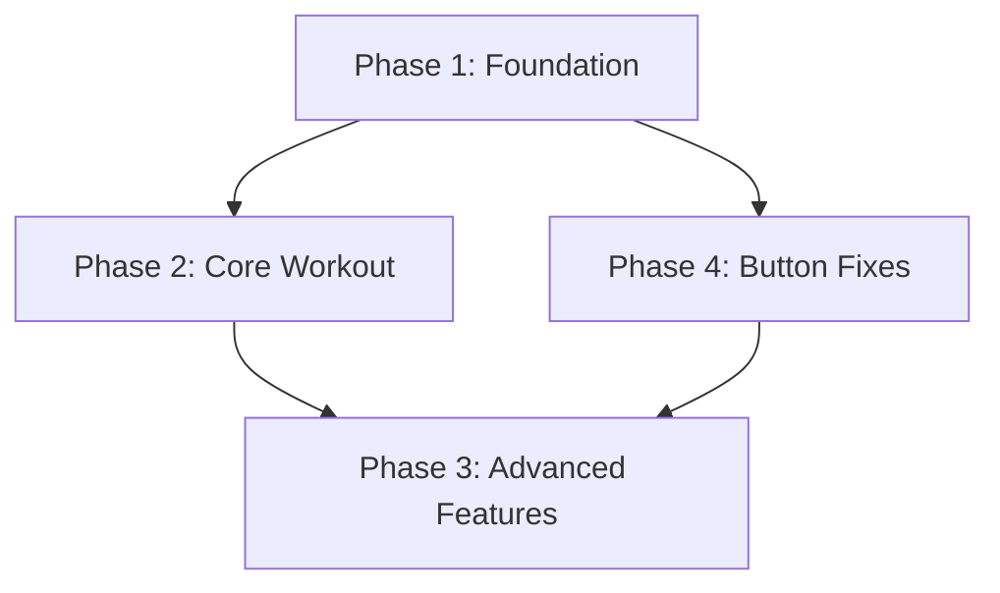

# Project Roadmap: FitForge - AI-Powered Fitness Ecosystem

**Last Updated**: 2025-01-28

## 1. Overall Project Vision & Goals
*   Create a comprehensive fitness tracking platform that eliminates friction in workout logging and progress monitoring
*   Provide real-time workout session tracking with intelligent progression recommendations
*   Build a community-driven ecosystem for fitness enthusiasts with analytics and social features

## 2. Major Project Phases / Epics

### Phase/Epic 1: Foundation & Infrastructure
*   **Description**: Core platform setup with authentication, database, and basic UI framework
*   **Status**: Completed
*   **Key Objectives**:
    *   React frontend with component library and routing
    *   Express backend with authentication and database integration
    *   Drizzle ORM with PostgreSQL and enhanced schema
*   **Primary HDTA Links**: 
    *   [frontend_module.md](memory-bank/frontend_module.md)
    *   [backend_module.md](memory-bank/backend_module.md)
    *   [database_module.md](memory-bank/database_module.md)
*   **Notes/Key Deliverables for this Phase/Epic**:
    *   Complete UI component library with Radix UI integration
    *   Authentication system with session management
    *   Database schema for users, workouts, and exercises

### Phase/Epic 2: Core Workout Functionality
*   **Description**: Implement workout creation, tracking, and basic progress monitoring
*   **Status**: Partially Completed
*   **Key Objectives**:
    *   Live workout session tracking
    *   Exercise database and workout templates
    *   Basic progress analytics and visualization
*   **Primary HDTA Links**: 
    *   [workout_module.md](memory-bank/workout_module.md)
    *   [analytics_module.md](memory-bank/analytics_module.md)
*   **Notes/Key Deliverables for this Phase/Epic**:
    *   Workout session state management
    *   Exercise library with 38+ exercises across 4 workout types
    *   Progress tracking with recharts integration

### Phase/Epic 3: Advanced Features & Polish
*   **Description**: Add nutrition tracking, community features, and advanced analytics
*   **Status**: Initial Planning
*   **Key Objectives**:
    *   Nutrition tracking and meal planning
    *   Community features and social sharing
    *   Advanced analytics with AI-powered insights
*   **Primary HDTA Links**: 
    *   [nutrition_module.md](memory-bank/nutrition_module.md)
    *   [community_module.md](memory-bank/community_module.md)
*   **Notes/Key Deliverables for this Phase/Epic**:
    *   Nutrition database and tracking interface
    *   Social features and user interactions
    *   Machine learning for workout recommendations

### Phase/Epic 4: Button Functionality & Navigation Fixes (CURRENT)
*   **Description**: Transform non-functional UI into fully operational application
*   **Status**: In Progress
*   **Key Objectives**:
    *   Implement onClick handlers for all navigation and action buttons
    *   Connect frontend components to backend APIs
    *   Complete routing configuration and user workflows
*   **Primary HDTA Links**: 
    *   [implementation_plan_button_functionality.md](memory-bank/implementation_plan_button_functionality.md)
*   **Notes/Key Deliverables for this Phase/Epic**:
    *   Systematic button audit and implementation roadmap
    *   Complete navigation functionality
    *   Workout component integration with backend logic

---

## 3. High-Level Inter-Phase/Epic Dependencies

## 4. Key Project-Wide Milestones
*   **Infrastructure Complete**: Foundation and database setup - Status: Achieved
*   **MVP Functionality**: Basic workout tracking operational - Status: In Progress (Phase 4)
*   **Beta Release**: Core features with button functionality - Status: Planned (Post Phase 4)
*   **Feature Complete**: All planned features implemented - Status: Planned (Post Phase 3)

## 5. Overall Project Notes / Strategic Considerations
*   Current focus on Phase 4 to transform UI showcase into functional application
*   WSL development environment requires special IP handling for browser testing
*   Interactive Web Debugging Extension being developed in parallel for enhanced development workflow
*   Branch strategy focuses on systematic fixes rather than new feature development