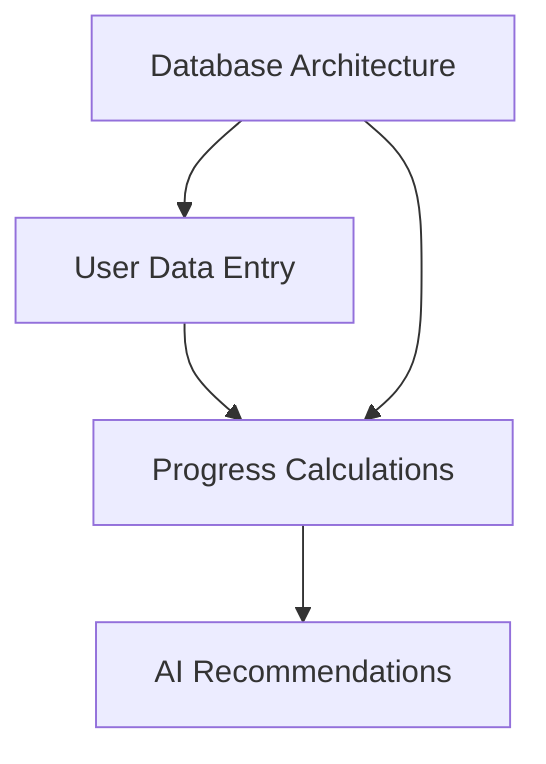

# Project Roadmap: FitForge - Real Data Architecture Implementation

**Last Updated**: 2025-05-30

## 1. Overall Project Vision & Goals
*   Build a completely data-driven fitness application with no mock data
*   Enable users to track real progress through transparent calculations
*   Provide AI recommendations based entirely on user workout history
*   Create clear data entry paths for all required information

## 2. Major Project Phases / Epics

### Phase 1: Database Architecture Foundation ✅ COMPLETED
*   **Description**: Design and implement complete data schemas for universal exercises and user-specific data
*   **Status**: ✅ COMPLETED (2025-05-31)
*   **Key Objectives**: ✅ ALL COMPLETED
    *   ✅ Universal exercise database with muscle percentages (38 exercises)
    *   ✅ Complete TypeScript schema with Zod validation
    *   ✅ RESTful API endpoints with search and recommendations
*   **Primary HDTA Links**: 
    *   ✅ `database_schema_module.md` - Universal Exercise Database
    *   ✅ `task_universal_exercise_schema.md` - COMPLETED implementation
*   **Deliverables COMPLETED**:
    *   ✅ Complete exercise schema with equipment and muscle data
    *   ✅ Database access layer with query functions
    *   ✅ API integration and validation systems
    *   ✅ Real data population scripts and testing

### Phase 2: User Data Entry Systems
*   **Description**: Build comprehensive forms and interfaces for all user data input
*   **Status**: Initial Planning
*   **Key Objectives**:
    *   Body stats tracking (weight, body fat, muscle mass)
    *   Goal setting for weight, strength, and workout frequency
    *   Enhanced workout logging with equipment and progression
*   **Primary HDTA Links**: 
    *   `user_data_entry_module.md`
*   **Notes/Key Deliverables**:
    *   Intuitive forms with validation and error handling
    *   Progressive disclosure for complex data entry

### Phase 3: Formula-Based Progress Calculations
*   **Description**: Implement transparent calculations that show formulas and data sources
*   **Status**: Not Started
*   **Key Objectives**:
    *   Weight and body composition progress tracking
    *   Exercise volume and strength progression analysis
    *   Goal achievement percentages with clear formulas
*   **Primary HDTA Links**: 
    *   `progress_calculations_module.md`
*   **Notes/Key Deliverables**:
    *   All metrics show calculation methods
    *   Clear indicators for missing data requirements

### Phase 4: AI-Powered Recommendations
*   **Description**: Build recommendation engine based entirely on user data patterns
*   **Status**: Not Started
*   **Key Objectives**:
    *   Progressive overload suggestions from workout history
    *   Exercise selection based on goals and equipment
    *   Plateau detection and breakthrough strategies
*   **Primary HDTA Links**: 
    *   `module_progressive_overload_ai.md`
*   **Notes/Key Deliverables**:
    *   Recommendations explain their reasoning
    *   No suggestions without sufficient user data

---

## 3. High-Level Inter-Phase Dependencies

## 4. Key Project-Wide Milestones
*   **No Mock Data Milestone**: Complete elimination of all fake data - Status: ✅ COMPLETED (Universal Exercise Database)
*   **Real User Flow**: Users can enter data and see real calculations - Status: Next Priority
*   **AI Recommendations**: Intelligent suggestions from user data - Status: Foundation Ready
*   **Production Ready**: Fully functional data-driven application - Status: Phase 1 Complete

## 5. Overall Project Notes / Strategic Considerations
*   Every feature must be designed database-first
*   UI should show formulas and data sources transparently
*   Missing data should be clearly indicated with entry paths
*   No feature should work with fake data - real user input only