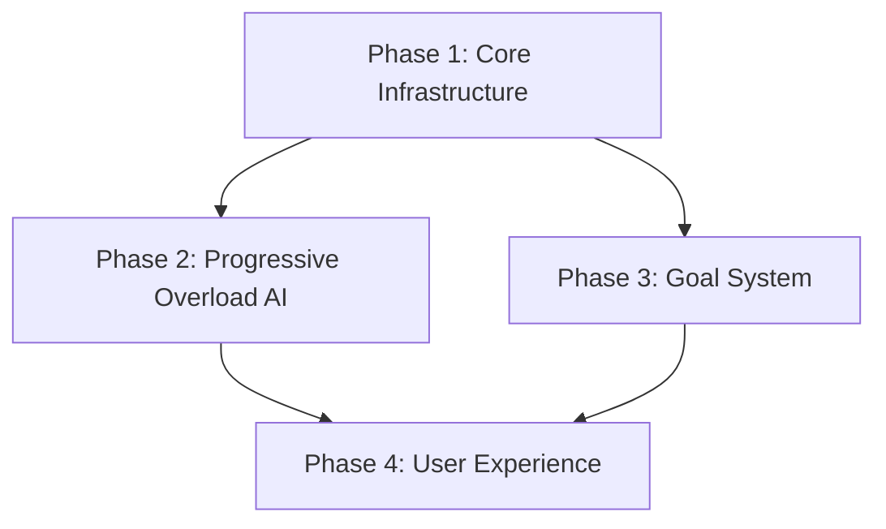

# Project Roadmap: FitForge - Real Data-Driven Fitness Ecosystem

**Last Updated**: 2025-06-03

## 1. Overall Project Vision & Goals
*   Create comprehensive fitness tracking platform with real user data and transparent calculations
*   Implement evidence-based progressive overload algorithms
*   Provide Excel-like data architecture for workout analytics
*   Ensure all features work with actual user input, no mock data

## 2. Major Project Phases / Epics

### Phase 1: Core Infrastructure & Data Architecture
*   **Description**: Establish unified storage system and real data foundations
*   **Status**: In Progress (Current Sprint)
*   **Key Objectives**:
    *   Resolve storage architecture mismatch (GitHub Issue #27)
    *   Implement unified workout data flow
    *   Establish TypeScript-first development workflow
*   **Primary HDTA Links**: 
    *   `implementation_plan_unified_storage_architecture.md`
    *   `database_schema_module.md`
*   **Notes/Key Deliverables for this Phase**:
    *   Seamless workout → progress display flow
    *   Elimination of data converter dependencies

### Phase 2: Progressive Overload & AI Features
*   **Description**: Implement smart progression algorithms and AI-powered recommendations
*   **Status**: Initial Planning
*   **Key Objectives**:
    *   Evidence-based progressive overload calculations
    *   Plateau detection and recovery suggestions
    *   Smart exercise selection algorithms
*   **Primary HDTA Links**: 
    *   `module_progressive_overload_ai.md`
    *   `implementation_plan_real_data_architecture.md`

### Phase 3: Goal System & Analytics
*   **Description**: Comprehensive goal tracking with formula transparency
*   **Status**: Partially Completed
*   **Key Objectives**:
    *   Real-time goal progress calculations
    *   Body composition tracking
    *   Achievement system with user milestones
*   **Primary HDTA Links**: 
    *   `goal_system_module.md` (to be created)
    *   `user_data_entry_module.md`

### Phase 4: User Experience & Performance
*   **Description**: Polish UI/UX and optimize performance
*   **Status**: Not Started
*   **Key Objectives**:
    *   Responsive design across devices
    *   Offline workout capabilities
    *   Performance optimization

## 3. High-Level Inter-Phase Dependencies

## 4. Key Project-Wide Milestones
*   **Storage Unification**: Unified workout data architecture - Status: In Progress
*   **MVP Completion**: Full workout → progress flow working - Status: Partially Achieved
*   **Real Data Architecture**: No mock data, all features use real input - Status: Achieved
*   **Production Ready**: Stable, tested, deployable version - Status: Planned

## 5. Overall Project Notes / Strategic Considerations
*   Real Data First: Every feature must work with actual user input
*   Formula Transparency: Users see how calculations work
*   Database-First Design: Schema design precedes feature implementation
*   TypeScript Full Coverage: No any types allowed
*   Evidence-Based Approach: All algorithms based on fitness science research